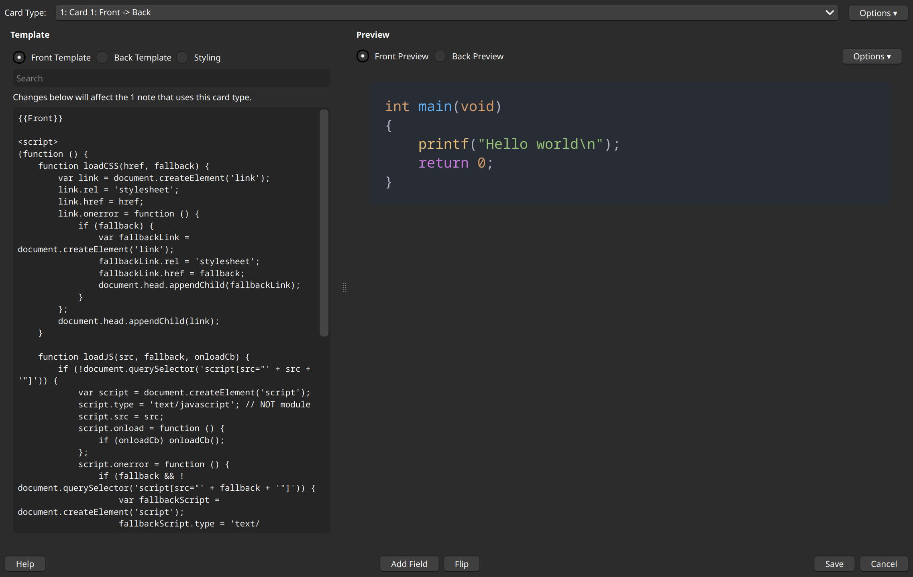

# Markdanki 🚬
Markdanki is a command-line tool that allows updating of Anki decks from a markdown file by leveraging [anki-connect](https://git.sr.ht/~foosoft/anki-connect).

### Usage
Requires zig version 0.16.0

```sh
cd src
zig run main.zig
```

### Purpose
I've started taking notes as a series of questions and answers - and I would love to be able to insert these into Anki. I write these notes in markdown, they often contain code blocks, and the act of manually inserting these into Anki is very painstaking. I would love a way to just write out some notes like this and have it inserted into Anki:

````md
### Q
What does `glDrawArrays` do?

### A
It draws primitives directly from array data.

### Q
What is a vertex attribute?

### A
Per-vertex value stored in a VBO and passed into the vertex shader.
Examples: position, color, normal, UV, etc.

### Q
How do you create a shader object?

### A
```C
unsigned int shaderObj;
shaderObj = glCreateShader(GL_VERTEX_SHADER);
```
````

Anki takes HTML as an input. So we must be extra careful when parsing and processing the back-ticks. Here is an example of how the conversion needs to happen:

Markdown:
```````md
`hello1`
``hello2```

```C
int main(void)
{
    printf("Hello, World!\n");
    return 0;
}
```

````md
```C
int x = 3;
```
````

```````

↑↓

HTML:
`````html
<code>hello</code>
<code>hello`</code>

<pre><code class="language-c">int main(void)
{
    printf(&quot;Hello, World!\n&quot;);
    return 0;
}
</code></pre>

<pre><code class="language-md">```C
int x = 3;
```
</code></pre>
`````

As you can see this process is actually quite involved. We must be able to process a group of any number of back-ticks. Also notice the HTML escape in the C section - `&quot;`, this is very important because we can have HTML blocks in here and it might mess up the formatting if we don't properly escape these characters. 
[XSS](https://en.wikipedia.org/wiki/Cross-site_scripting) itself isn't a concern because this is a local application.[Here](https://mateam.net/html-escape-characters/) is a list of them. As long as the following is implemented all should be okay:

```
" --> &quot;
& --> &amp;
' --> &#39;
< --> &lt;
> --> &gt;
```

Syntax highlighting is done via highlight.js. The card template is [here](anki_front_template.html). This template will work with both the CDN and local versions of hljs.


